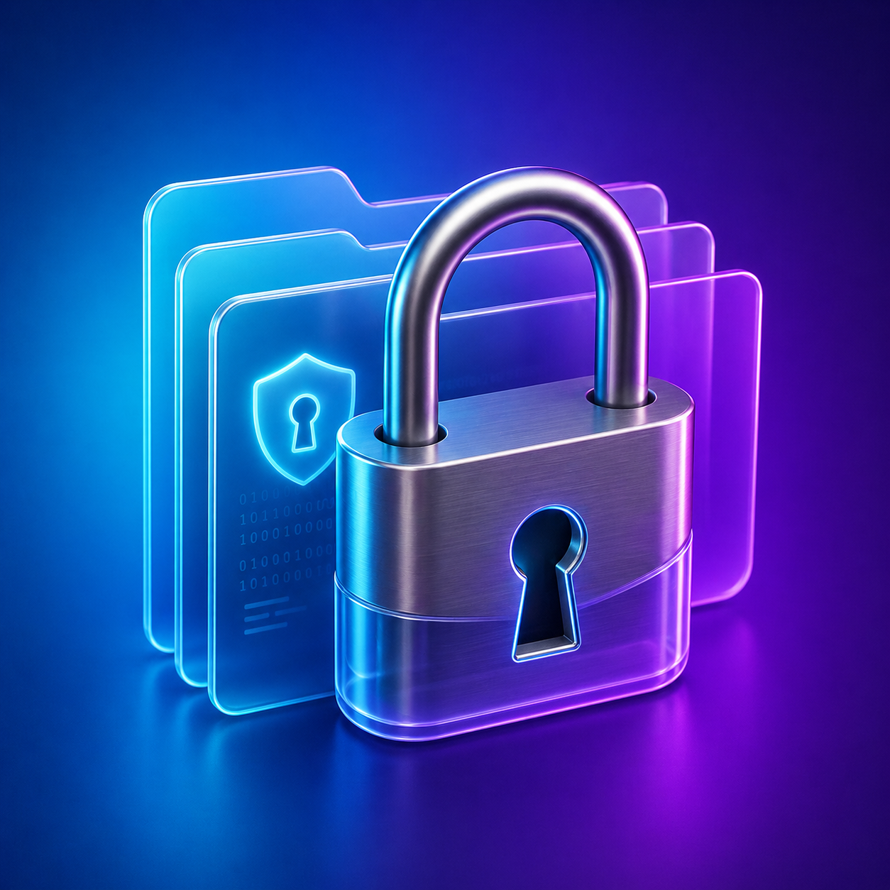
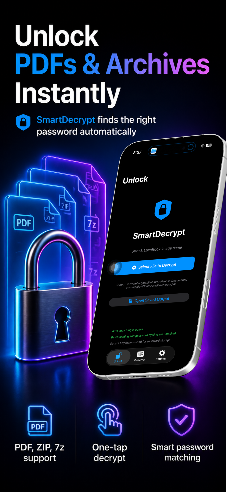
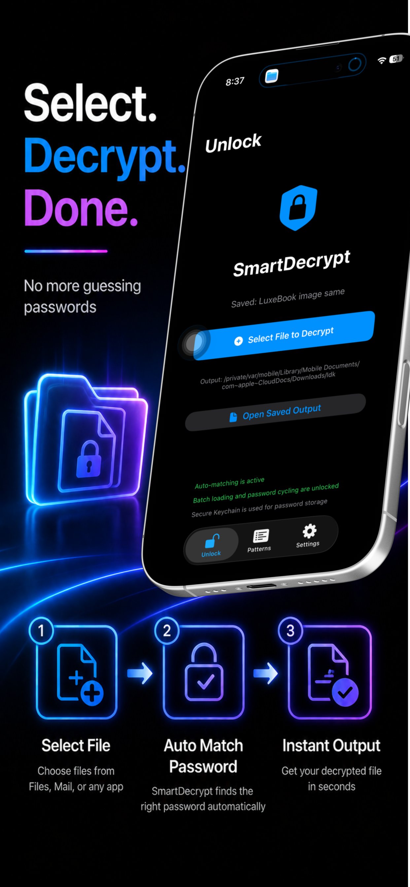
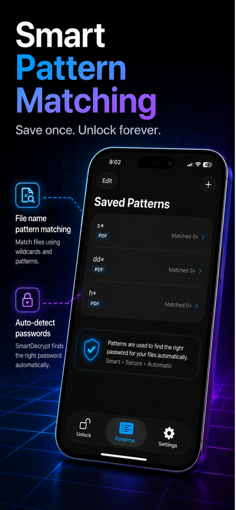
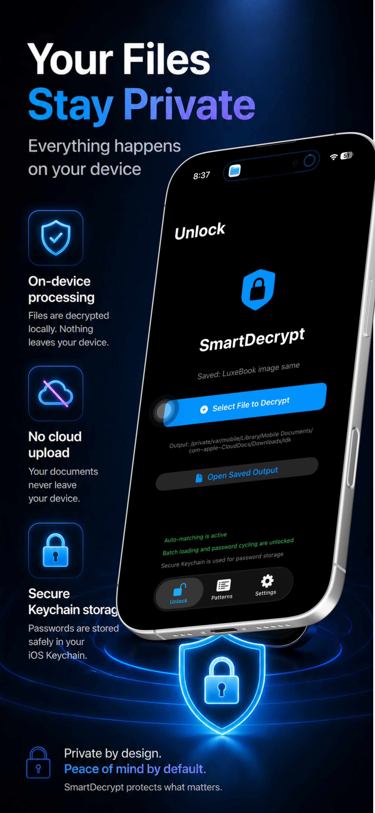
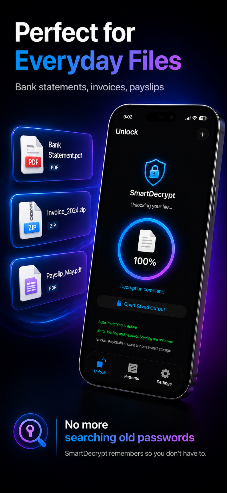

  

<h1 align="center">SmartDecrypt PDF ZIP</h1>

  <strong>Auto-unlock PDF &amp; archives</strong> 
  Drop encrypted files. SmartDecrypt finds the right saved password automatically.

  
  &nbsp;
  

---

## What is SmartDecrypt?

SmartDecrypt helps you unlock password-protected PDFs and archives without hunting through notes, messages, or old emails for the right password.

Save a pattern once — such as a bank statement or invoice filename format — and SmartDecrypt matches future files automatically and decrypts them instantly, no prompts needed.

Available as a **universal purchase** for both iPhone/iPad and Mac. Buy once, use on all your Apple devices with the same Apple ID.

---

## Screenshots

  
  
  

  
  

---

## Features

### Supported Formats
- **PDF** — Unlock password-protected documents
- **ZIP** — Extract encrypted ZIP archives
- **7z** — Extract encrypted 7z archives
- Unencrypted ZIP and 7z archives extract normally, no password needed

### Smart Pattern Matching
Define a pattern once based on a filename prefix, suffix, or keyword. SmartDecrypt remembers it and automatically applies the right password to every matching file — no manual selection required.

### iOS
- Open files directly in the app
- Send files via the **iOS Share Sheet** from Files, Mail, or any app
- Background decryption keeps the UI responsive

### macOS
- **Drag and drop** files into the unlock queue
- Choose files from Finder
- Pick same-folder output or select a custom destination folder

### Security
- Passwords stored in the **system Keychain** — never in plain text
- All decryption runs **locally on device** — your files are never uploaded
- Non-destructive PDF unlocking: the original is preserved as `*_original.pdf`

---

## Free vs Pro

| | Free | Pro |
|---|:---:|:---:|
| Unlock PDF files | ✓ | ✓ |
| Extract ZIP / 7z | ✓ | ✓ |
| Save password patterns | ✓ | ✓ |
| Process one file at a time | ✓ | ✓ |
| Batch file loading | — | ✓ |
| Automatic password cycling | — | ✓ |

**SmartDecrypt Pro** is a one-time purchase of **USD 9.99** — no subscription, no recurring fees. Universal across iOS and macOS.

---

## Privacy

SmartDecrypt stores saved passwords in the Apple Keychain. File unlocking runs entirely on your device. The app does not upload your documents for processing.

- [Privacy Policy](PRIVACY.md)
- [Terms of Service / EULA](TERMS.md)

---

## Download

| Platform | Store |
|---|---|
| iPhone / iPad / Mac | [App Store](https://apps.apple.com/app/smartdecrypt-pdf-zip/id6763979229) |
| Windows PC | [Microsoft Store](https://apps.microsoft.com/store/detail/9P9BFKR5ZDZ8) |
